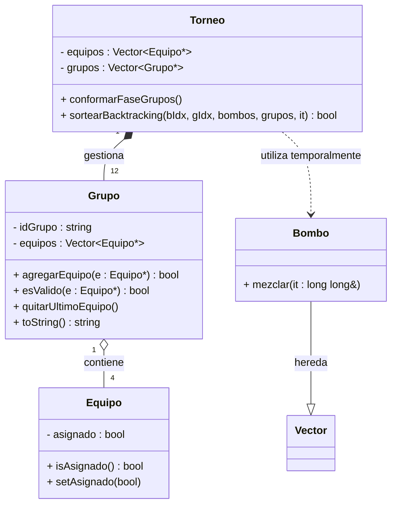

# Conformación de los grupos para la etapa clasificatoria de grupos. 

Esta etapa tiene una guia de pasos bastante solida y por ende se parte de ella, de forma directa.

Los equipos del mundial 2026 se organizan en 12 grupos, cada grupo se identifica con una letra y contiene 4 equipos. Partiendo de los datos de los equipos obtenidos en el paso previo, el procedimiento es el siguiente:

1. Conformación de los bombos del sorteo: 
    -  El país anfitrión va directamente al bombo 1. A efectos de este desafío,  asuma que hay sólo un país sede (EE. UU.) 
    -  Los demás equipos se ordenan por ranking FIFA y se reparten en 4 bombos de 12 selecciones (bombo 1 = mejor ranking, bombo 4 = peor). 
2. Conformación de los grupos  
    -  Se saca al azar un equipo de cada bombo para cada grupo, hasta  completar los 12 grupos. 
    -  No se permiten dos selecciones de la misma confederación en el mismo grupo, salvo UEFA, que puede tener máximo dos equipos por grupo. 

> Ejemplo:
> Grupo X = un cabeza de serie del bombo 1, uno del bombo 2, uno del 3 y uno del 4, respetando las restricciones de confederación. Al finalizar, imprima en pantalla los grupos conformados, incluya la confederación de cada uno de los equipos. 

---

## Analisis preliminar

Se implementa la clase `Grupo` identificada previamente, a la que no se le habia encontrado utilidad. La implementacion de la misma seguirá esta ruta:

> [!IMPORTANT]
> La clase **equipo** ya ha sido implementada; se agrega de forma referencial para aludir a las propiedades que rean usadas en esta etapa.

## TODO

- [x] Módulo de Bombos:
    - [x] Implementar la búsqueda del anfitrión (United States) para forzar su lugar en el Bombo 1
    - [x] Segmentar el vector ordenado en 4 sub-vectores (Vector<Equipo*>) de 12 elementos cada uno

- [ ] Módulo de Sorteo (Grupos):
    - [x] Crear 12 instancias de la clase Grupo.
    - [x] Implementar la lógica de selección aleatoria (un equipo de cada bombo por grupo)
    - [ ] Validación de Confederación: Desarrollar el algoritmo que verifique la restricción geográfica (máximo 1 de cada confederación, excepto UEFA que permite 2)
> [!NOTE]
> Si un sorteo viola esta regla, el equipo debe re-sortearse o moverse al siguiente grupo disponible.
- [x] Módulo de Visualización:
    - [x] Sobrecargar el operador de inserción o usar toString() para mostrar los 12 grupos con sus países y confederaciones

