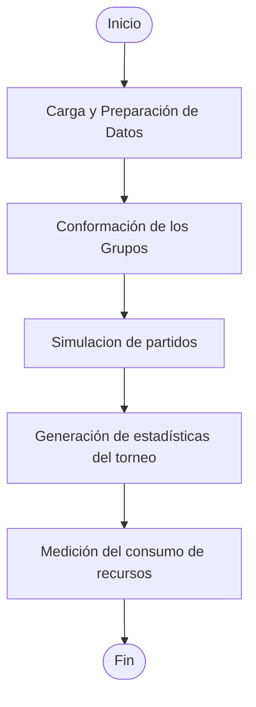
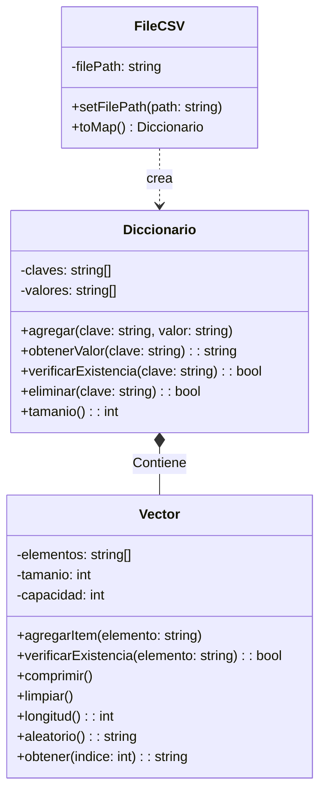
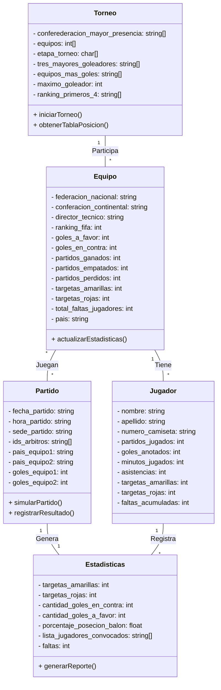

# FIFA 2026 - SIMULADOR DE TORNEO, DESAFíO 2

Cordial saludo esta es una actividad del curso Informatica 2, corresponde a el desafio 2. A continuacion se detalla el proceso de analisis y diseño de sistema solicitado.

**FIFA 2026**: Consiste en desarrollar un programa de consola en c++ (cons POO) para la simulacion de los partidos del mundial de futbol FIFA 2026 aprovechando datos historicos.

Se deben cubrir las siguientes funcionalidades:

1. Carga y actualizacion de datos (desde .csv)
2. Conformacion de los grupos para etapa clasificatoria (R16)
3. Simulacion de partidos (R16/R8/QF/SF/F)
4. Generacion de estadisticas del torneo
5. Medición del consumo de recursos (no funcional)

---

## Analisís del problema

Entremos en detalle, porque si decimos (simular). No queda lo suficientemente clara la idea. En este caso particular. Con simular nos referimos a generar un resultado teorico del torneo considerando (probabilidades/tendecias) con sierto grado de aleatoriedad. Es decir, no se trata de generar resultados completamente aleatorios, sino en aprovechar datos historicos. Y combinarlo con un modelo (sistema que aprovecha esos datos) para generar resultados teoricos.

Ahora pasando a evaluar el como de la solucion teorica, surgen algunas preguntas, obviaremos concocimientos de futbol, y nos centraremos en el como de la solucion. Para esto, se pueden identificar algunos puntos clave:

### ¿Cual es el flujo general del simulador?

---

## Carga y actualización de datos

Una forma simple de manipular estos datos que entran en formato .csv, es crear una función que lea el archivo y almacene los datos en una estructura de datos adecuada (como un vector o un diccionario). Esto permitirá acceder a la información de manera eficiente durante la simulación del torneo. Sin emabargo, ya que no se puede usar STL, consideramos crear nuestra propia libreria de vectores y diccionarios para manejar estos datos de manera eficiente.

### Diagrama de clases de bajo nivel para la carga de datos

### Diagrama de flujo para la carga de datos

## Conformacion de grupos

En la etapa de carga de datos, se crea una estructura de datos que almacena la información de los equipos, jugadores, partidos y torneos. Esta estructura de datos se puede utilizar para conformar los grupos para la etapa actual del toneo. Para esto partimos de agrupar en Bombo 1, Bombo 2, Bombo 3 y Bombo 4, los equipos segun su ranking FIFA. Luego se procede a conformar los grupos de manera aleatoria, asegurando que cada grupo tenga un equipo de cada bombo. En este caso el metodo aleatorio de la clase Vector puede ser utilizado para seleccionar equipos de cada bombo de manera aleatoria. Por lo que Bombo 1, Bombo 2, Bombo 3 y Bombo 4 pueden ser representados como instancias de la clase Vector, y el proceso de conformacion de grupos puede ser implementado utilizando el metodo aleatorio para seleccionar equipos de cada bombo.

### Diagrama de flujo para la conformacion de grupos

## Simulacion de partidos

Pasamos a simular los partidos, en esta etapa hay algunas consideraciones como:

- **Probabilidades**: En el documento hay formulas y requisitos para la simulacion de partidos para cada etapa del torneo. 

### Diagrama de clases PRINCIPAL para la simulacion de partidos

---

> [!IMPORTANT]
> CRITERIOS DE EVALUACION AVANCE 1:
> - [ ] Analisis del problema
> - [ ] Diagrama de clases
> - [ ] 4 Algoritmos