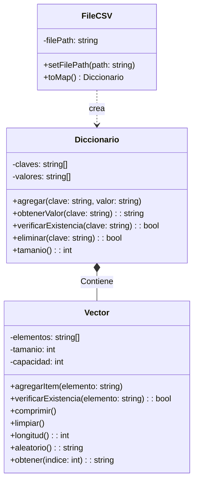
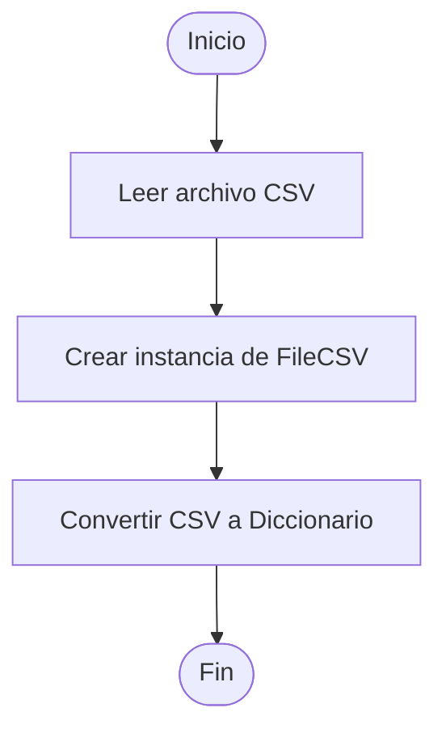
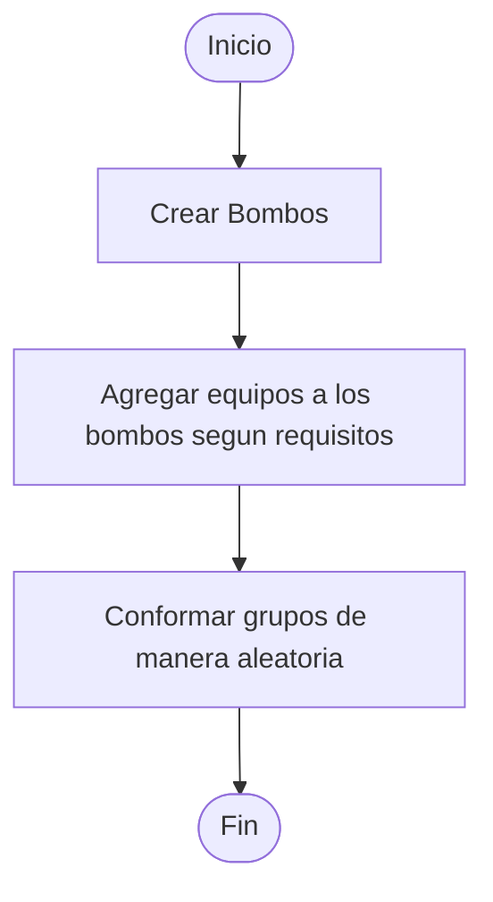
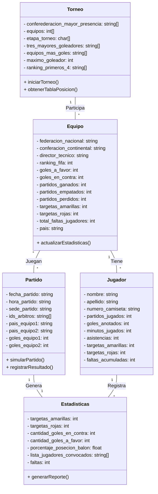

# FIFA 2026 - SIMULADOR DE TORNEO, DESAFíO 2

Cordial saludo esta es una actividad del curso Informatica 2, corresponde a el desafio 2. A continuacion se detalla el proceso de analisis y diseño de sistema solicitado.

**FIFA 2026**: Consiste en desarrollar un programa de consola en c++ (con POO) para la simulacion de los partidos del mundial de futbol FIFA 2026 aprovechando datos historicos.

Se deben cubrir las siguientes funcionalidades:

1. Carga y actualizacion de datos (desde .csv)
2. Conformacion de los grupos para etapa clasificatoria (R16)
3. Simulacion de partidos (R16/R8/QF/SF/F)
4. Generacion de estadisticas del torneo
5. Medición del consumo de recursos (no funcional)

---

## Analisís del problema

---

> [!WARNING]
> La simulacion no comprende todas las mecanicas de juego en la vida real sino que se centra en generar un resultado, que toma como directriz los criterios de la actividad y cito **"La simulación se centra en la obtención de los resultados indicados y no en emular las dinámicas de juego internas de los partidos"** (Desafio Info 2026-1 v.1.1).

---

Se nos proporciono una tabla; el contenido es tal como se describe acontinuacion (fidelidad de columnas por fila).  

| Ranking FIFA | País | Director técnico | Federación de fútbol | Confederación | Goles a favor | Goles en contra | Partidos ganados | Partidos empatados | Partidos perdidos |
|--------------|------|------------------|----------------------|---------------|---------------|----------------|------------------|--------------------|--------------------|
| 1 | France | Didier Deschamps | French Football Federation | UEFA | 20 | 5 | 7 | 1 | 0 |
| 2 | Spain | Luis de la Fuente | Royal Spanish Football Federation | UEFA | 20 | 5 | 7 | 1 | 0 |
| 3 | Argentina | Lionel Scaloni | Argentina Football Association | CONMEBOL | 26 | 8 | 8 | 1 | 1 |
| 4 | England | Thomas Tuchel | The Football Association | UEFA | 20 | 5 | 7 | 1 | 0 |
| 5 | Portugal | Roberto Martinez | Portuguese Football Federation | UEFA | 20 | 5 | 7 | 1 | 0 |
| 6 | Brazil | Dorival Junior | Brazilian Football Confederation | CONMEBOL | 20 | 7 | 6 | 3 | 1 |
| 7 | Netherlands | Ronald Koeman | Royal Dutch Football Association | UEFA | 20 | 5 | 7 | 1 | 0 |
| . | ----------- | ------------- | -------------------------------- | ---- | -- | - | - | - | - |
| . | ----------- | ------------- | -------------------------------- | ---- | -- | - | - | - | - |
| . | ----------- | ------------- | -------------------------------- | ---- | -- | - | - | - | - |
| 59 | Cabo Verde | Bubista | Cape Verdean Football Federation | CAF | 10 | 1 | 5 | 1 | 0 |

---

Hay **48 selecciones (aunque el ranking tiene saltos, son 48 filas reales). Cada una tiene:

- Un **Ranking FIFA (número: 1,2,3... Hasta 59).
- Un **país**
- Un **director técnico** (no lo usaremos mucho pero ahí está).
- **Estadisticas hístoricas:** Goles a favor (GF), goles en contra (GC), partidos ganados (PG), empatados (PE), perdidos (PP)

---

Cada selección tiene 26 jugadores. Del archivo no sabemos quiénes son un requisito es fabricarlos artificialmente en un principio:

- Les ponemos camisetas del 1 al 26.
- Les asignamos nombres genéricos: "nombre1", "apellido1", "nombre2", "apellido2", etc.
- Sus estadísticas individuales empiezan en cero, excepto los goles.

### Pregunta central del **Desafío**

¿Como podemos determinar quién ganaría el mundial con esta información?: No podemos simplemente decir "el de mejor ranking gana", porque el fútbol tiene sorpresas. Pero tampoco queremos resultados completamente al azar. Necesitamos un **mecanismo intermedio**. Es precisamente el **mecanismo intermedio** lo que nos ocupa.

### ¿Cual es el flujo general del simulador?

La idea de **simular** partidos es un reto interesante, sin embargo, no debemos olvidar que este **Desafío/Taller** no busca **emular un resultado realista** sino en **obtener un resultado**, por lo tanto partimos de un logica simple:

- Un equipo que históricamente hace muchos goles, probablemente seguirá haciéndolos.
- Un equipo que históricamente recibe muchos goles, probablemente seguirá recibiéndolos.

---

En este punto, ya hemos proporcionado una nocion incial de **que y como** se desarrollará el **simulador**. Ahora abordaremos **funcionalidades/partes** del sistema.

Con este **diagrama** se busca transmitir una nocion del flujo del programa, sin redactar mucho texto. Presta cuidado a el orden de ejecucion. No hay simultaniedad, por lo que se espera que los datos que ocupa cada parte para trabajar sea accesible para todos, y **como criterio de evaluacion** debemos hacer un uso eficiente de memoria mediante *constructores de copia*.

> [!NOTE]
> 

---

## Carga y actualización de datos

Una forma simple de manipular estos datos que entran en formato .csv, es crear una función que lea el archivo y almacene los datos en una estructura de datos adecuada (como un vector o un diccionario). Esto permitirá acceder a la información de manera eficiente durante la simulación del torneo. Sin emabargo, ya que no se puede usar STL, consideramos crear nuestra propia libreria de vectores y diccionarios para manejar estos datos de manera eficiente.

### Diagrama de clases de bajo nivel para la carga de datos

### Diagrama de flujo para la carga de datos

## Conformacion de grupos

En la etapa de carga de datos, se crea una estructura de datos que almacena la información de los equipos, jugadores, partidos y torneos. Esta estructura de datos se puede utilizar para conformar los grupos para la etapa actual del toneo. Para esto partimos de agrupar en Bombo 1, Bombo 2, Bombo 3 y Bombo 4, los equipos segun su ranking FIFA. Luego se procede a conformar los grupos de manera aleatoria, asegurando que cada grupo tenga un equipo de cada bombo. En este caso el metodo aleatorio de la clase Vector puede ser utilizado para seleccionar equipos de cada bombo de manera aleatoria. Por lo que Bombo 1, Bombo 2, Bombo 3 y Bombo 4 pueden ser representados como instancias de la clase Vector, y el proceso de conformacion de grupos puede ser implementado utilizando el metodo aleatorio para seleccionar equipos de cada bombo.

### Diagrama de flujo para la conformacion de grupos

## Simulacion de partidos

Pasamos a simular los partidos, en esta etapa hay algunas consideraciones como:

- **Probabilidades**: En el documento hay formulas y requisitos para la simulacion de partidos para cada etapa del torneo. 

### Diagrama de clases PRINCIPAL para la simulacion de partidos

> [!NOTE]
> El desafío actual tiene un **contexto guía** en el que se usa un lenguaje tecnico, y aunque con algo de analisis y dedicacion, podemos llegar a una respuesta intuitiva, la necesidad de planear en este informe **analisis del problema** supone **simplificacion**.

---

> [!IMPORTANT]
> CRITERIOS DE EVALUACION AVANCE 1:
> - [ ] Analisis del problema
> - [ ] Diagrama de clases
> - [ ] 4 Algoritmos

---